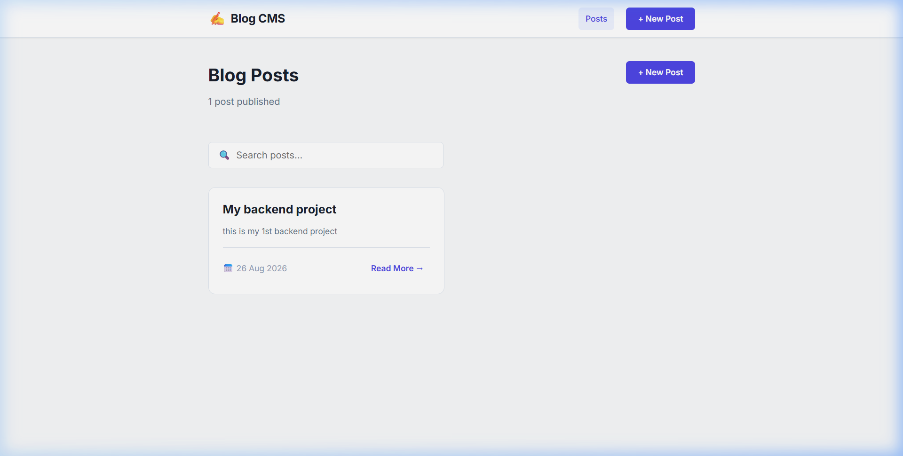
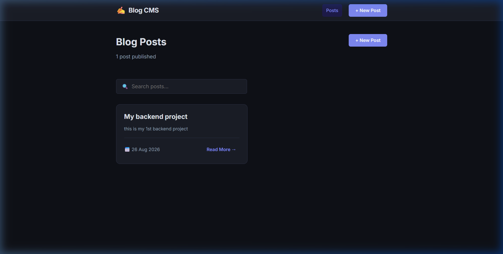
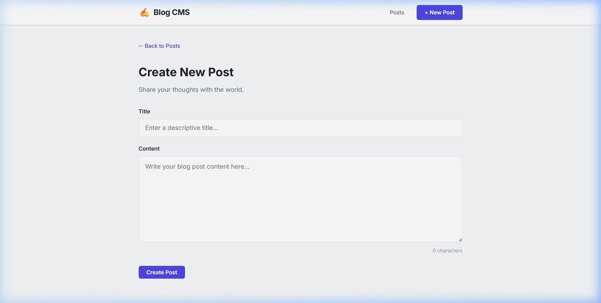
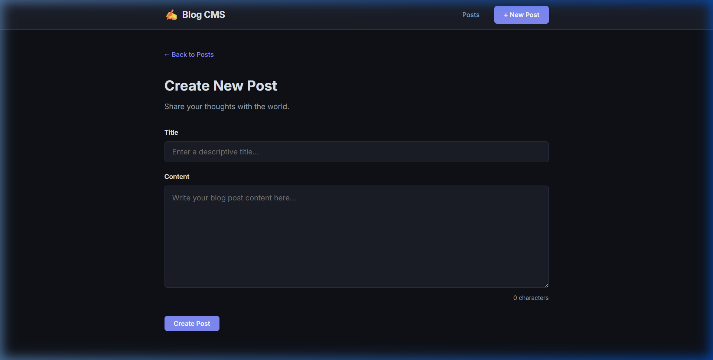

# 🔥 Blog CMS — Full-Stack Content Management System

> A full-stack blog management application built as a college club recruitment project.

**🌐 Live Demo:** [https://blog-cms-owgy.vercel.app](https://blog-cms-owgy.vercel.app)  
**🔗 Backend API:** [https://blog-cms-oop5.onrender.com/api/posts](https://blog-cms-oop5.onrender.com/api/posts)

---

## 1. Project Title

**Blog CMS** — A Full-Stack Blog / Content Management System

---

## 2. Objective

The objective of this project is to build a production-ready, full-stack web application that demonstrates core software engineering skills:

- Designing and consuming a RESTful API
- Persisting data in a relational database (SQLite)
- Building a reactive frontend with React
- Deploying a split frontend/backend architecture to the cloud (Vercel + Render)
- Managing environment-specific configuration using environment variables

---

## 3. Problem Statement

Content management is a fundamental need in web development. Most beginners either:
- Build a frontend with no real backend (data is lost on refresh), or
- Use a bloated CMS framework without understanding how data flows end-to-end.

This project solves that by building a **minimal but complete CMS from scratch** — where every layer (UI → API → Database) is hand-written and understood, not abstracted away.

**Key challenges solved:**
- How does a React component fetch and display data from a server?
- How does an Express backend validate and store form input?
- How do you keep dev and production environments separate without changing code?
- How do you deploy a Node.js + SQLite backend to a cloud server?

---

## 4. Tech Stack

| Layer | Technology | Purpose |
|-------|-----------|---------|
| **Frontend** | React 19 + Vite | Component-based UI with fast HMR dev server |
| **Routing** | React Router v7 | Client-side navigation (SPA) |
| **Backend** | Node.js + Express 5 | RESTful HTTP API server |
| **Database** | SQLite via `better-sqlite3` | Embedded relational database (no separate server) |
| **Styling** | Vanilla CSS | Custom responsive design without frameworks |
| **HTTP Client** | Fetch API (built-in) | Making API requests from the browser |
| **Frontend Deploy** | Vercel | CDN-hosted static React build |
| **Backend Deploy** | Render | Persistent Node.js process with disk-backed SQLite |
| **Env Config** | Vite `import.meta.env` | Environment-specific API URL without code changes |

---

## 5. Implementation Approach

The application follows a clean **separation of concerns** architecture:

```
Browser
   ↓
Vercel (React Frontend — static files)
   ↓  HTTPS request
Render (Express Backend — running Node.js)
   ↓  SQL query
SQLite (blog.db — on Render's persistent disk)
   ↓  JSON response
React UI updates
```

### Key Design Decisions

**1. Centralized API Service (`src/services/api.js`)**  
All `fetch()` calls live in one file. Pages never call `fetch()` directly — they call named functions like `getPosts()`, `createPost()`. This means if the backend URL changes, only one file needs updating.

**2. Environment Variables for API URL**  
```js
const BASE_URL = import.meta.env.VITE_API_URL || 'https://blog-cms-oop5.onrender.com/api';
```
- Locally → reads `VITE_API_URL=http://localhost:5000/api` from `.env`
- On Vercel → reads `VITE_API_URL` from Vercel dashboard environment variables
- Same codebase, zero code changes between environments

**3. SQLite on Render (not Vercel)**  
Vercel runs serverless functions — each request spins up a new process, so file-based SQLite would lose data. Render runs a persistent process, keeping `blog.db` alive on disk.

**4. MVC-style Backend Structure**  
- `server.js` → middleware + route mounting
- `routes/postRoutes.js` → URL → handler mapping
- `controllers/postController.js` → business logic + SQL queries
- `database/database.js` → schema + connection

---

## 6. Features

| Feature | Description |
|---------|------------|
| 📋 **View All Posts** | Home page shows all posts in a responsive card grid with post count |
| 🔍 **Search Posts** | Real-time client-side search filters posts by title or content |
| 📖 **Read Post** | Individual post detail page with formatted date |
| ✏️ **Create Post** | Form with title + content, character counter, and validation |
| 🔄 **Edit Post** | Pre-filled edit form, saves changes via PUT request |
| 🗑️ **Delete Post** | Delete with confirmation dialog, redirects on success |
| 🌙 **Dark / Light Mode** | Toggle in the navbar; preference saved in localStorage across sessions |
| ⚡ **Loading States** | Spinner shown while API requests are in flight |
| ❌ **Error States** | User-friendly error messages on every page |
| 📭 **Empty State** | "No posts yet" prompt with Create button |
| 📱 **Responsive Design** | Works on desktop and mobile screens |

---

## 7. Screenshots

### 🌞 Light Mode — Home Page


### 🌙 Dark Mode — Home Page


### 🌞 Light Mode — Create Post


### 🌙 Dark Mode — Create Post


---

## 8. How to Run

### Prerequisites
- [Node.js v18+](https://nodejs.org/)
- npm (comes with Node.js)

### Clone the Repository

```bash
git clone https://github.com/pjkorba1256-cmd/blog_cms.git
cd blog-cms
```

### Backend Setup

```bash
cd backend
npm install
npm start
# ✅ Server running at http://localhost:5000
# ✅ SQLite database auto-created at backend/database/blog.db
```

### Frontend Setup

Open a **second terminal**:

```bash
cd frontend
npm install
```

Create the local environment file:

```bash
# Create frontend/.env
echo "VITE_API_URL=http://localhost:5000/api" > .env
```

Start the dev server:

```bash
npm run dev
# ✅ App running at http://localhost:5173
```

Open **http://localhost:5173** in your browser.

### API Endpoints

| Method | Endpoint | Description |
|--------|----------|-------------|
| `GET` | `/api/posts` | Get all posts |
| `GET` | `/api/posts/:id` | Get one post by ID |
| `POST` | `/api/posts` | Create a new post |
| `PUT` | `/api/posts/:id` | Update an existing post |
| `DELETE` | `/api/posts/:id` | Delete a post |
| `GET` | `/api/health` | Health check |

**Example — Create a post via curl:**
```bash
curl -X POST http://localhost:5000/api/posts \
  -H "Content-Type: application/json" \
  -d '{"title": "My First Post", "content": "Hello, world!"}'
```

### Database Schema

```sql
CREATE TABLE posts (
    id         INTEGER  PRIMARY KEY AUTOINCREMENT,
    title      TEXT     NOT NULL,
    content    TEXT     NOT NULL,
    created_at DATETIME DEFAULT CURRENT_TIMESTAMP,
    updated_at DATETIME DEFAULT CURRENT_TIMESTAMP
);
```

### Project Structure

```
blog-cms/
├── frontend/                  # React + Vite application
│   ├── .env                   # Local environment variables (gitignored)
│   ├── src/
│   │   ├── components/
│   │   │   ├── Navbar.jsx     # Top navigation bar
│   │   │   ├── PostCard.jsx   # Post preview card component
│   │   │   └── PostForm.jsx   # Reusable form for create/edit
│   │   ├── pages/
│   │   │   ├── Home.jsx       # Post list + search
│   │   │   ├── CreatePost.jsx # New post form
│   │   │   ├── PostDetails.jsx# Individual post view
│   │   │   └── EditPost.jsx   # Edit post form
│   │   ├── services/
│   │   │   └── api.js         # ALL fetch() calls in one place
│   │   ├── App.jsx            # Router setup
│   │   └── index.css          # Global styles
│   └── vercel.json            # Vercel SPA routing config
│
└── backend/                   # Node.js + Express API
    ├── server.js              # Entry point, middleware, error handling
    ├── routes/
    │   └── postRoutes.js      # URL → controller mappings
    ├── controllers/
    │   └── postController.js  # CRUD logic + SQL queries
    └── database/
        ├── database.js        # SQLite connection + schema creation
        └── blog.db            # Auto-generated database file (gitignored)
```

---

## 9. Future Improvements

| Improvement | Why |
|-------------|-----|
| **User Authentication** | Currently anyone can create/edit/delete posts. JWT-based login would restrict write access. |
| **Rich Text Editor** | Replace the plain textarea with a Markdown or WYSIWYG editor for formatted posts. |
| **Image Upload** | Allow posts to include a cover image (would require cloud storage like Cloudinary). |
| **Pagination** | Currently all posts are fetched at once. Pagination with `LIMIT/OFFSET` would scale better. |
| **Post Categories / Tags** | Let authors organize posts by topic for easier discovery. |
| **PostgreSQL Migration** | SQLite is great for this project, but for multi-user production apps, PostgreSQL on Supabase or Railway would be more robust. |
| **Post Draft / Published Status** | Add a `status` column so authors can save drafts before publishing. |
